# Uber New York Data Analysis

## Project Description

Data analyst got a project to analyze Uber pickups on New York to get insight from this data. The challenges of these project include :

- Analyzing which month have max uber pickup
- Analyzing Hourly Rush in New York
- Analyzing Most Active Uber Base Number
- Perform Spatial Analysis to find what locations of New York City are getting Rush
- Perform Pair Wise Analysis to Examine Rush Hour

## Tools & Library Used

 &nbsp;
 &nbsp;

 &nbsp;
 &nbsp;
 &nbsp;
 &nbsp;
 &nbsp;

## Dataset Used

- [Uber Foil](https://github.com/nickenshidqia/Uber-New-York-Data-Analysis/tree/main/Dataset)
- [Uber Jan - Juni](https://github.com/nickenshidqia/Uber-New-York-Data-Analysis/tree/main/Dataset)

## Project Result

[Click here to get on full code](https://github.com/nickenshidqia/Uber-New-York-Data-Analysis/blob/f4e1279861533c3dd3e3446997b00c402574cf91/uber_analysis.ipynb)

### Analyzing which month have max uber pickup

Create new dataset that includes Month, and Frequency of Uber pickups. Then plot the dataset into the bar chart.  
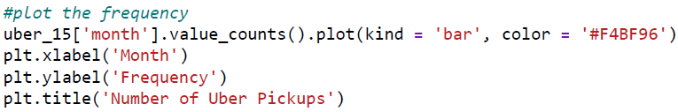  
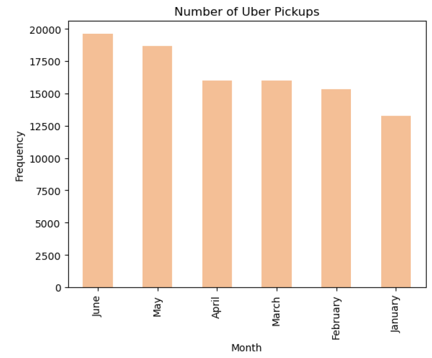

**Insight :**  
June seems to have max number of pickups on Uber

Extract the dataset to get weekday, day, hour, and minute to create new table :  
 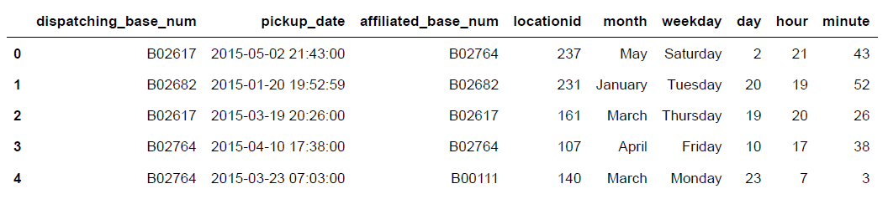

Then create pivot table or cross tabulation :  
 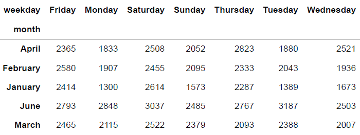

Plot the pivot table into bar chart to get insight what is the highest weekdays of uber pickups  
 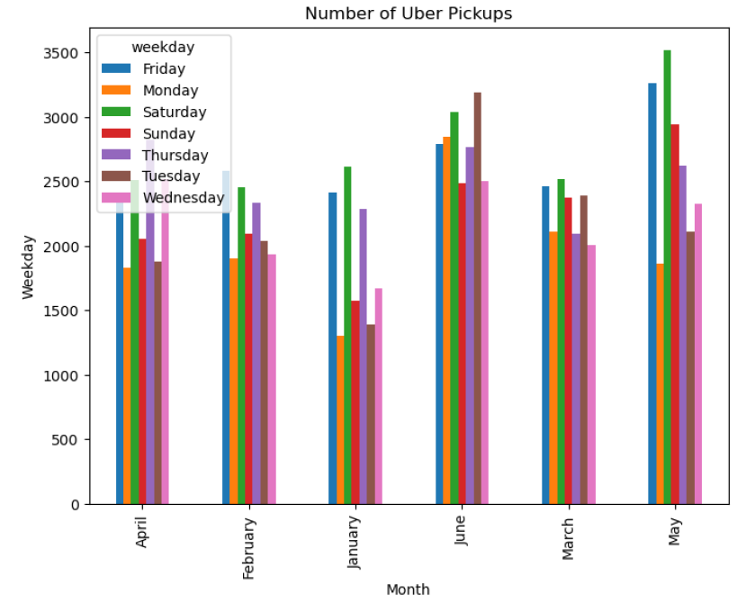

**Insight :**  
The highest number of pickups in each month is on Friday and Saturday.  
It seems people on New York hanging out a lot on these days, like go shopping, spend time with family outside, etc.

### Analyzing Hourly Rush in New York

Create new dataset that includes Weekday, hour, and frequency. Then plot the dataset into line plot.  
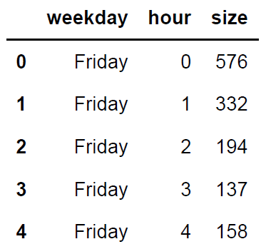  
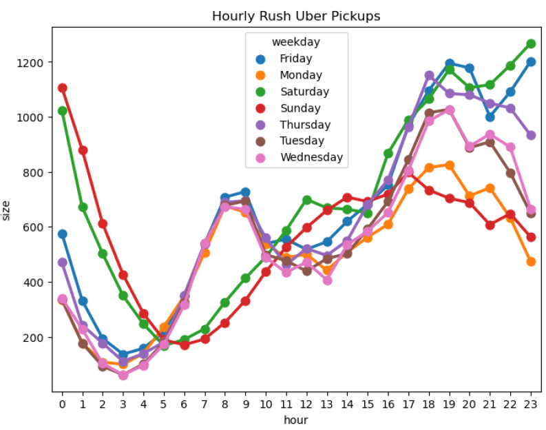

**Insight :**  
It seems Saturday and Sunday has similar trend in late night, morning, and afternoon. But in the evening (starts from 17:00) they exhibits opposite trend, where Saturday pickup continue to increasing, but Sunday pickupstakes a downward turn.

### Analyzing Most Active Uber Base Number

Create new dataset that includes base number, date, and active vehicles.  
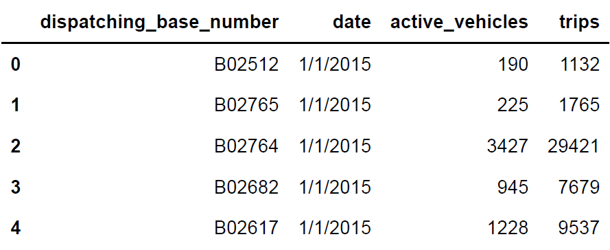

Create pivot table to know what is the most active Uber base number :  
 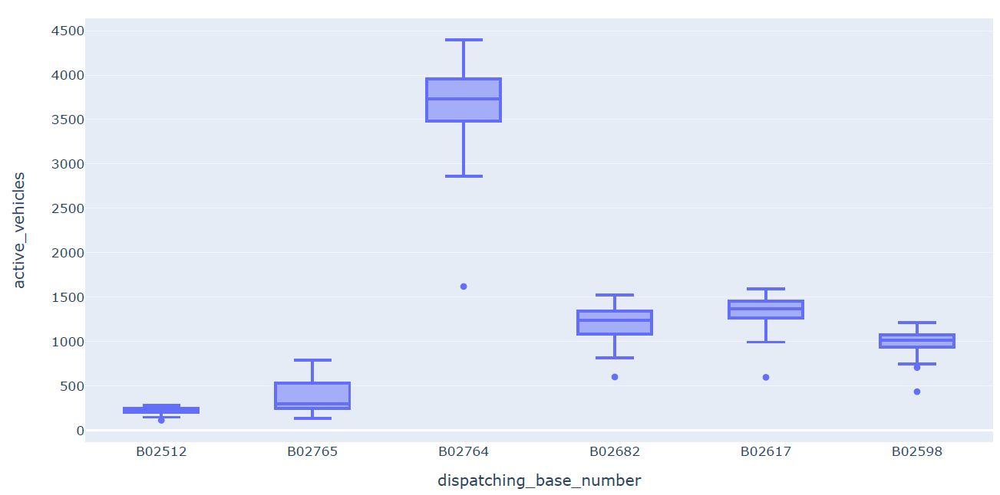

**Insight :**  
The most active Uber base number is B02764 with 5 summary stats of data :

- min = 2,862 active vehicles
- q1 (25th percentile) = 3,483 active vehicles
- q2 (50th percentile) = 3,734 active vehicles
- q3 (75th percentile) = 3,957 active vehicles
- max = 4,396 active vehicles

Create violin plot to see distribution and 5 summary stats of data :  
 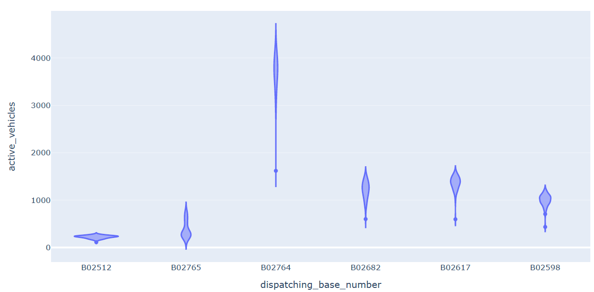

### Perform Spatial Analysis to find what locations of New York City are getting Rush

Create new dataset that includes latitude, longitude, and frequency.  
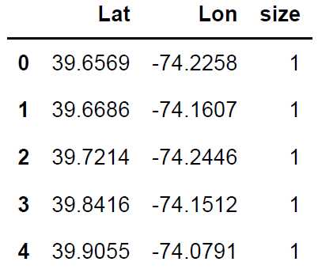

Create heatmap to find what locations of New York City are getting Rush :  
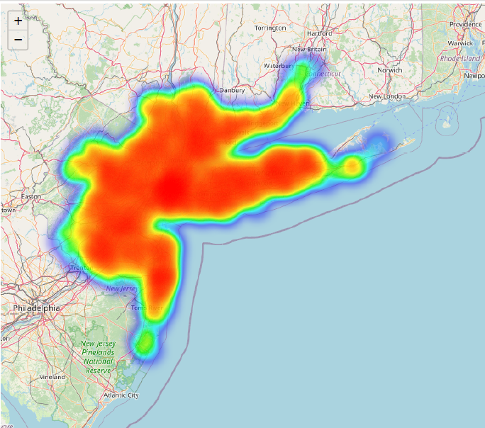

**Insight :**  
Midtown Manhattan is the locations of New York City that are getting Rush, because from this heatmap, it is clearly huge bright spot.  
The reason maybe because Manhattan is the most densely populated of New York City’s.

### Perform Pair Wise Analysis to Examine Rush Hour

Create pivot table that includes day, hour, and frequency.    
Then styling pivot table into gradient color.  
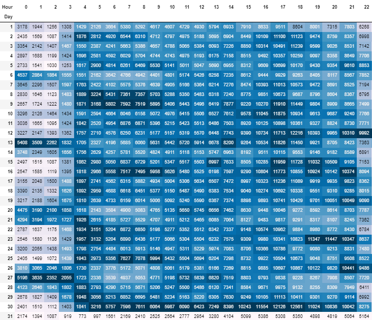

**Insight :**  
The darker the color, the more getting rush.  
Example :  
Day 9 from 06:00 until 08:00 A.M are getting rush, because it seems people in New York are getting ready to work, school, etc.
